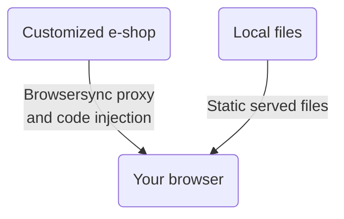

# Shoptet Bender 🤖
## Introduction
Shoptet Bender proxies remote e-shop to localhost while injecting and serving your local JavaScripts and CSS styles. This tool enables the development of visual changes without breaking the production e-shop. It is also suitable for Premium e-shop development, while emulation of the Blank mode is possible.

**Now with optional SSL/HTTPS support via [local-ip.co](https://local-ip.co)** for testing HTTPS-only features like Service Workers, PWAs, and more!

## How it works



## Install

### Prerequisites
- Node.js >= 18 **OR**
- Bun >= 1.0 (recommended for faster performance)

### Global Installation (Recommended)

Install globally to use the `shp-bender` CLI command from anywhere:

**Using Bun (Recommended - Faster):**
```bash
bun install -g git+https://github.com/shoptet/shoptet-bender.git
```

**Using Yarn:**
```bash
yarn global add git+https://github.com/shoptet/shoptet-bender.git
```

**Using npm:**
```bash
npm install -g git+https://github.com/shoptet/shoptet-bender.git
```

After global installation, use the CLI:
```bash
shp-bender --remote https://classic.shoptet.cz/ --ssl
```

### Local Development (For Contributors)

If you're developing/modifying this tool:

```bash
git clone https://github.com/shoptet/shoptet-bender.git
cd shoptet-bender

# Install dependencies (Bun is faster)
bun install
# or: npm install --legacy-peer-deps

# Run locally (always uses Node.js for SSL compatibility)
npm run dev --remote https://classic.shoptet.cz/ --ssl
```

### SSL Certificates (Optional)
SSL certificates from local-ip.co are already included in the `certs/` directory. If you need to update them:

```bash
cd certs/
curl -L -o server.pem https://local-ip.co/cert/server.pem
curl -L -o chain.pem https://local-ip.co/cert/chain.pem
curl -L -o server.key https://local-ip.co/cert/server.key
```

ℹ️ On Windows platform, you may need to add Yarn binary to your path:
- copy the output of the `yarn global bin` command, e.g. *C:\Users\YOUR_PROFILE\AppData\Local\Yarn\bin*
- open "**System properties**" and click on the "**Environment Variables**" button
- select "**Path**", click on "**Edit**" -> "**New**", paste the copied output and save
- you need to open a new instance of the CLI interface to take an effect

## Usage
### Step-by-step guide to start

1. 📁 If you want to use the prepared build step, create a following folder structure:

```
src/
├── footer/
│   ├── script1.js
│   └── script2.js
├── header/
│   ├── markup.html
│   └── style.css
└── orderFinale/
    └── remarketing.js
```

2. 📝 Create or move your script and styles to the corresponding folders
3. 🖥️ Run the CLI tool (assumes global installation):

```bash
shp-bender --remote https://classic.shoptet.cz/
```

And you're ready to go -> enjoy coding and development 🎉

**Note:** The tool runs the same regardless of whether you installed with npm, yarn, or bun. The CLI command is always `shp-bender`.

### Using SSL/HTTPS (Optional)

**Option 1: Using CLI flag (temporary)**

```bash
shp-bender --remote https://classic.shoptet.cz/ --ssl
```

**Option 2: Using config.json (permanent)**

Edit your `config.json` file:

```json
{
  "defaultUrl": "https://classic.shoptet.cz/",
  "sourceFolder": "./src",
  "outputFolder": "./dist",
  "ssl": true
}
```

Then just run:
```bash
shp-bender --remote https://classic.shoptet.cz/
```

**Note:** CLI flag `--ssl` always takes precedence over config file setting.

When SSL is enabled:
- 🔒 The server runs with HTTPS instead of HTTP
- 📍 Access via `https://127-0-0-1.my.local-ip.co:3010` (for local access)
- ✅ No certificate warnings - trusted by all browsers!
- 🌐 Other devices on your network can access it too

**Why use SSL?**
- Test HTTPS-only browser features (Service Workers, PWAs, Geolocation API, etc.)
- Match production environment more closely
- Share your development site with team members securely

**Note:** The IP format replaces dots with hyphens. For example, `192.168.1.100` becomes `192-168-1-100.my.local-ip.co`

**OR**

Try `shp-bender -h` for CLI help

**OR**

🚀 Use our [Boilerplate wizard](https://github.com/shoptet/create-visual-addon-boilerplate) for even faster start. 🚀

### CLI Options

- `-r, --remote <url>` - URL of the remote Eshop with https:// prefix
- `-w, --watch` - Watch for changes and reload the page (default: true)
- `-b, --blankMode` - Simulate the blank template (default: false)
- `-n, --notify` - Display pop-over notifications in the browser (default: false)
- `-s, --ssl` - Enable HTTPS via local-ip.co **[NEW]**
- `-rh, --removeHeaderIncludes [items...]` - Remove header includes
- `-rf, --removeFooterIncludes [items...]` - Remove footer includes

### Removing existing scripts and styles

If you want to remove existing scripts and styles, you can use the `--removeHeaderIncludes` or `--removeFooterIncludes` flag followed by the string you want to remove. You can target for example number of the addon, or specific URL, project includes or comment in the script.

## Alternative Package Manager: Bun

You can choose between npm, yarn, or [Bun](https://bun.sh) for package installation. Bun offers faster installation times:

| Package Manager | Typical Install Time |
|----------------|---------------------|
| npm/yarn | ~30-40s |
| Bun | ~10-15s ⚡ |

**Benefits of using Bun:**
- Faster package installation
- Efficient dependency resolution
- Lower disk space usage
- Same development experience - the CLI runs on Node.js regardless of installation method

**Note:** Bun is optional and only used for package installation. The `shp-bender` CLI always runs on Node.js to ensure full compatibility with BrowserSync and SSL features.

**Install Bun:**
```bash
# macOS/Linux
curl -fsSL https://bun.sh/install | bash

# Windows
powershell -c "irm bun.sh/install.ps1 | iex"
```

## SSL/HTTPS Support

Optional SSL/HTTPS support using [local-ip.co](https://local-ip.co) certificates. The implementation:

- ✅ Maintains backward compatibility (SSL is opt-in via `--ssl` flag)
- ✅ Automatically detects your local IP address
- ✅ Provides trusted SSL certificates (no browser warnings)
- ✅ Enables testing of HTTPS-only browser features
- ✅ Allows network access from other devices
- ✅ Bun support for faster installation

## Security Notice

⚠️ The local-ip.co SSL certificates are publicly available and shared by all users. They are suitable for **local development only**, never for production use.

## Possible tool improvements
Shoptet Bender is an open-source project, and we'd love your help! Shoptet doesn't have the resources to work on this tool continuously, so it's a great chance for you to jump in and make it better. We've listed some feature ideas to get you started, but feel free to create your own. Even small updates can make a big difference, and your contributions are really valued!
